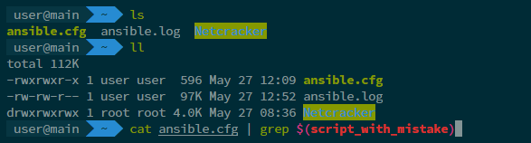

## Auto beauty ZSH

This script is designed to automatically install and configure zsh. The result of script execution:


### Quick start
1. [Install ansible](https://docs.ansible.com/ansible/latest/installation_guide/intro_installation.html)
2. Clone repo
3. Fill file ```hosts``` with vm details from ```hosts_template```
```bash
cp hosts_template hosts 
```
4. Replace YOUR_IP_ADDRESS, YOUR_USER_NAME, YOUR_PASSWORD and YOUR_ROOT_PASSWORD or configure ansible connection as your want if you are extended ansible user. Notice that user shoul can use a sudo by `become: yes`
5. start ansible playbook
```bash
ansible-playbook install_beauty_zsh.yaml -i hosts
```

### Configurations
Default configuration placed here: `roles/install_ohmyzsh/defaults/main.yaml`
You can override it here if you are using script manually, or create ansible inventory.

| Variable              | Description                                                                              | Default value                                                    |
|-----------------------|------------------------------------------------------------------------------------------|------------------------------------------------------------------|
| ohmyzsh_home_dir      | User home directory, like `/home/username`                                               | `~`                                                              |
| ohmyzsh_installer_url | Url to Oh-My-ZSH installer script                                                        | "https://raw.github.com/ohmyzsh/ohmyzsh/master/tools/install.sh" |
| ohmyzsh_zsh_custom    | Url to custom oh-my-zsh folder                                                           | "{{ ohmyzsh_home_dir }}/.oh-my-zsh/custom"                       |
| ohmyzsh_plugins       | List of plugins to install. To add one more define name, git_url and destination for it. | *code is too big*                                                |
| ohmyzsh_theme         | Default theme                                                                            | Default theme                                                    |
